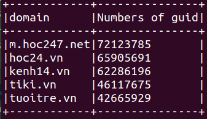
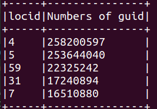
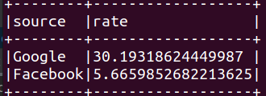

### **1. ppcv**
- Chạy task bằng lệnh spark-submit:

`  spark-submit --class ppcvTask\
  --deploy-mode client\
  --num-executors 5 \
  --executor-cores 2 \
  --executor-memory 2G \
  target/InternTask-1.0-SNAPSHOT.jar`

- **Kết quả các task được lưu dưới dạng parquet tại:**
  - Lấy top 5 domain có số lượng GUID nhiều nhất.: hdfs:/DataIntern2022/result/ppcv/res1
    - 
  - Lấy top 5 vị trí địa lý có nhiều GUID truy cập nhất: hdfs:/DataIntern2022/result/ppcv/res2
    - 
  - Tính tỉ lệ pageview phát sinh từ google, fb: hdfs:/DataIntern2022/result/ppcv/res3
    - 

### **2. apcdx**
- **Chạy task bằng spark-submit:**

`  spark-submit --class apcdxTask\
  --deploy-mode client\
  --num-executors 5 \
  --executor-cores 2 \
  --executor-memory 2G \
  target/Task1-1.0-SNAPSHOT.jar`
- **Kết quả các task được lưu dưới dạng parquet tại:**
  - Đếm số  GUID theo từng bannerid theo ngày: hdfs:/DataIntern2022/result/apcdx/res1
  - Đếm số  GUID theo từng bannerid theo tháng: hdfs:/DataIntern2022/result/apcdx/res2
  - Tính toán việc phân bổ bannerid theo từng domain: hdfs:/DataIntern2022/result/apcdx/res3